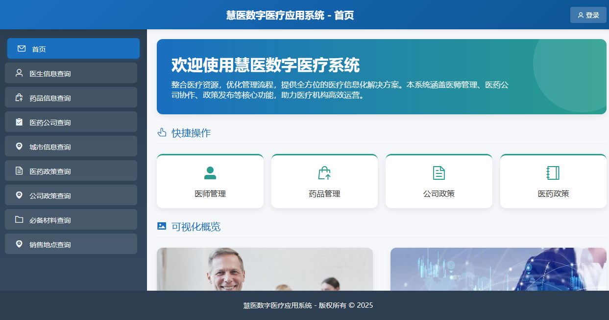
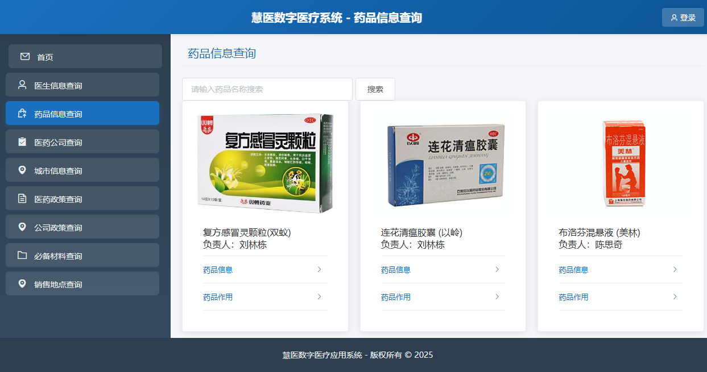
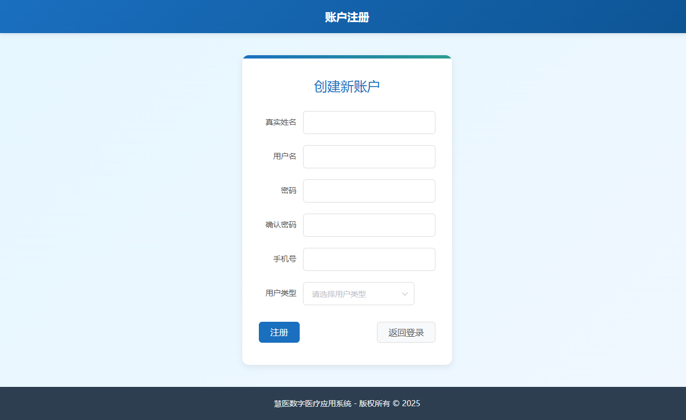
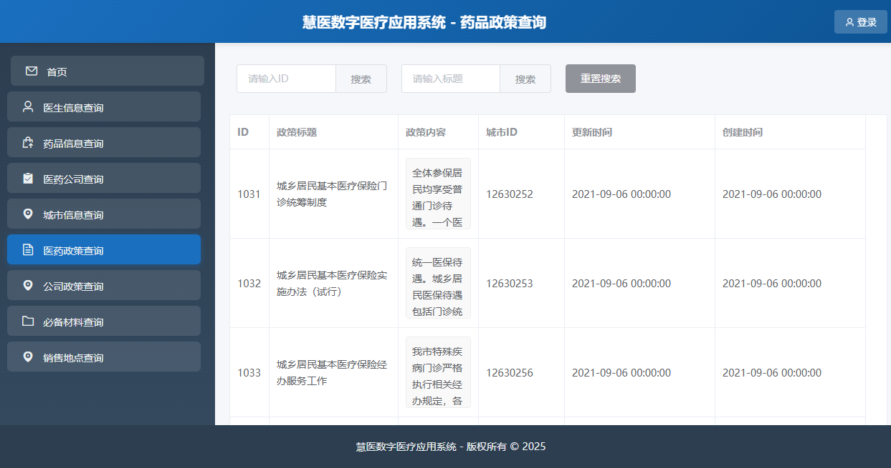

# 🏥 慧医数字医疗系统

基于 **Spring Boot 2.7 + Vue 2 + Element UI + MyBatis-Plus** 的医疗信息管理平台，为「Java高级」课程大作业，三人协作开发。

> 🔗 GitHub: [https://github.com/15wind/myMedicalSystem](https://github.com/15wind/myMedicalSystem)

---

## 📸 项目截图

### 首页仪表盘


### 药品信息管理


### 用户注册


### 医保政策管理


---

## 🗄️ 数据库设计

| 表名 | 说明 |
|------|------|
| `account` | 用户账户表（注册/登录） |
| `doctor` | 医生信息表 |
| `doctor_level` | 医师职级表 |
| `treat_type` | 诊治类别表 |
| `drug` | 药品信息表 |
| `drugcompany` | 药企信息表 |
| `drug_sale` | 药品-销售关联表 |
| `sale` | 销售网点表 |
| `medical_policy` | 医保政策表 |
| `company_policy` | 公司政策表 |
| `material` | 物资信息表 |
| `patient` | 患者信息表 |
| `china` | 全国省市表（自关联） |
| `city` | 城市编号表 |
| `sysregion` | 区域编码表 |
| `permission` | 权限菜单表 |
| `role_permission` | 角色-权限关联表 |

> 完整 DDL 见 [`sql/init.sql`](sql/init.sql)

---

## 🚀 技术栈

| 层级 | 技术 |
|------|------|
| **后端框架** | Spring Boot 2.7.18 |
| **持久层** | MyBatis-Plus 3.5.4 |
| **数据库** | MySQL 8.0 |
| **连接池** | Druid 1.2.23 |
| **前端框架** | Vue 2 + Element UI（CDN 引入） |
| **数据可视化** | ECharts 5.4 |
| **异步请求** | Axios |
| **构建工具** | Maven |
| **Java 版本** | JDK 17 |

---

## 📦 功能模块

| 模块 | 说明 |
|------|------|
| 🏠 **首页仪表盘** | 系统概览、数据统计图表（ECharts） |
| 👤 **登录注册** | 用户注册、登录认证 |
| 💊 **药品管理** | 药品信息增删改查、图片上传、关键词搜索 |
| 📋 **医保政策** | 政策发布、编辑、删除 |
| 👨‍⚕️ **医生管理** | 医生信息维护、职级分类 |
| 🏭 **药企管理** | 制药公司信息管理 |
| 💰 **销售管理** | 药品销售信息、销售网点关联 |
| 📊 **物资管理** | 医疗物资信息管理 |
| 🗺️ **地区管理** | 全国省市数据维护 |

---

## 🏗️ 项目结构

```
myMedicalSystem/
├── src/main/java/com/example/mymedicalsystem/
│   ├── controller/          # REST 控制器（10个）
│   ├── service/             # 业务逻辑层
│   │   └── impl/            # 业务实现
│   ├── mapper/              # MyBatis-Plus Mapper 接口
│   ├── model/               # 实体模型（14个数据表）
│   ├── handler/             # 自动填充处理器
│   └── MyMedicalSystemApplication.java  # 启动入口
├── src/main/resources/
│   ├── application.example.yml  # 配置示例
│   ├── Mapper/              # XML 映射文件
│   └── static/              # 前端页面（17个HTML） + 静态资源
├── sql/
│   └── init.sql             # 数据库建表脚本（DDL）
└── src/test/                # 单元测试
```

---

## ⚡ 快速启动

### 环境要求

- JDK 17+
- MySQL 8.0+
- Maven 3.6+

### 1. 创建数据库并导入表结构

```bash
# 先创建数据库
mysql -uroot -p -e "CREATE DATABASE IF NOT EXISTS demo CHARACTER SET utf8mb4 COLLATE utf8mb4_unicode_ci;"

# 导入建表脚本
mysql -uroot -p demo < sql/init.sql
```

> 也可以直接使用 IDEA 或 DataGrip 等工具执行 `sql/init.sql`

### 2. 配置数据库连接

复制 `src/main/resources/application.example.yml` 为 `application.yml`，修改数据库连接信息：

```yaml
spring:
  datasource:
    driver-class-name: com.mysql.cj.jdbc.Driver
    url: jdbc:mysql://localhost:3306/demo
    hikari:
      username: root
      password: '你的密码'
```

### 3. 启动项目

```bash
mvn spring-boot:run
```

或使用 IDEA 直接运行 `MyMedicalSystemApplication.java`

### 4. 访问系统

浏览器打开：**http://localhost**

> 默认端口为 80，可在 `application.yml` 中修改 `server.port`

---

## 👥 协作分工

| 成员 | 负责模块 |
|------|---------|
| **我（项目统筹）** | 首页仪表盘、登录注册、药品信息管理、医保政策管理（前端+后端） |
| 队友 A | 医生管理、药企管理 |
| 队友 B | 销售管理、物资管理、地区管理 |

---

## 📖 我的前端练习

> 🔗 [web-frontend-practice](https://github.com/15wind/web-frontend-practice)

包含前端练习代码：

- **HTML/CSS**：14 个页面（Flex 布局、表单、表格、导航栏等）
- **JavaScript/Vue**：16 个页面（DOM 操作、事件监听、Vue 指令、Axios 异步交互）

---

## ⚠️ 注意事项

- 本项目为课程大作业，仅供学习参考
- 密码等敏感信息已从代码中移除（使用 `application.example.yml` 模板）
- 部分代码风格不统一（三人分工协作导致），持续优化中
